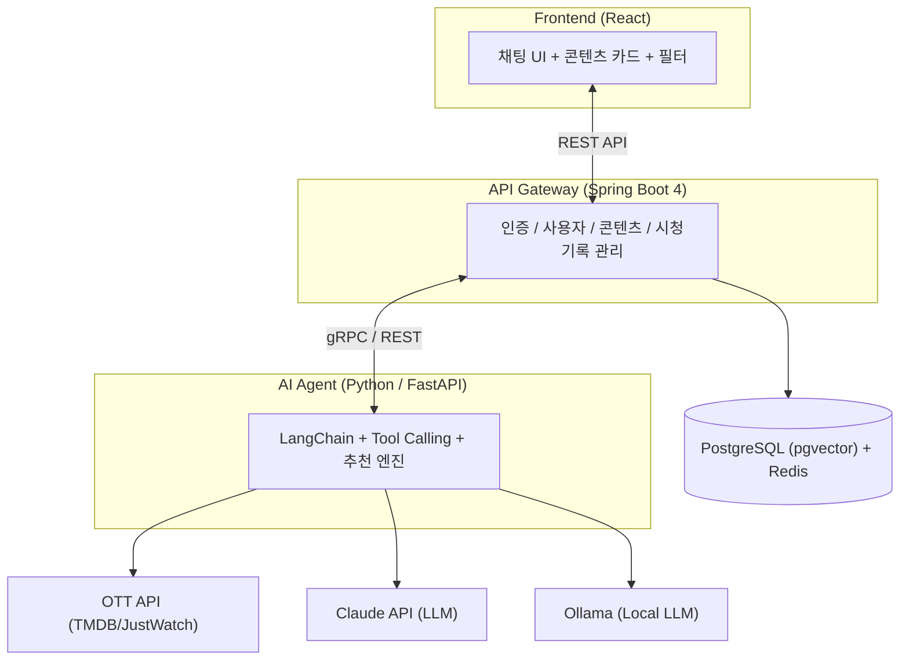
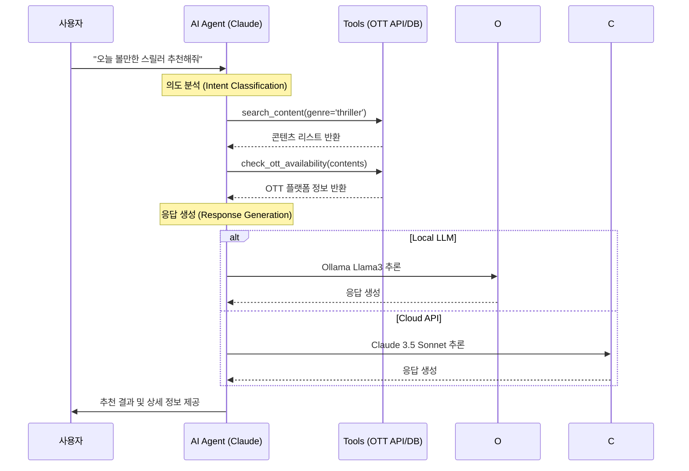
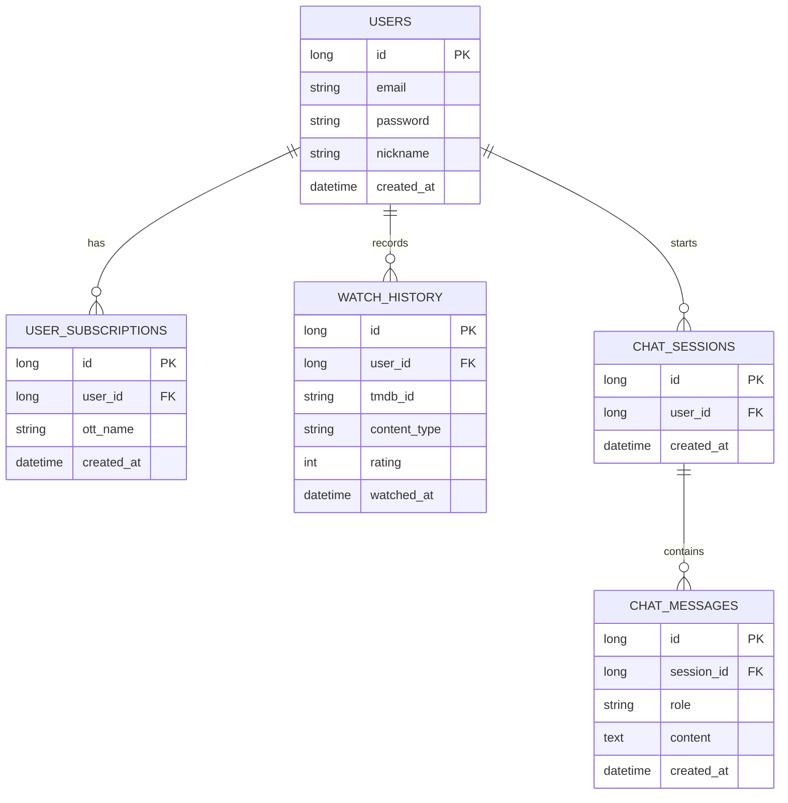

# 🎬 OTTi - OTT 통합 콘텐츠 추천 AI Agent

> "오늘 뭐 볼지 고민하는 시간을 줄여주는 AI"

**OTTi**(OTT + AI)는 여러 OTT 플랫폼에 흩어진 콘텐츠를 한 곳에서 대화형으로 추천받을 수 있는 AI Agent 서비스입니다.
넷플릭스, 쿠팡플레이, 디즈니+, 웨이브, 왓챠 등 구독 중인 OTT를 기반으로 취향에 맞는 콘텐츠를 찾아드립니다.

<!-- 스크린샷/GIF 추가 예정 -->
<!--  -->

---

## ✨ 주요 기능

### 🗣️ 대화형 추천
자연어로 원하는 콘텐츠를 요청하면 AI가 조건을 분석해 맞춤 추천합니다.

```
사용자: "넷플릭스에서 볼 만한 스릴러 추천해줘, 평점 높은 거"
Agent:  장르, OTT, 평점 조건을 분석해서 최적의 콘텐츠 5개를 추천드립니다!
```

### 🎯 OTT 필터링
구독 중인 OTT만 필터링해서 바로 볼 수 있는 콘텐츠만 추천합니다.

### 😊 감정 기반 추천
기분이나 상황을 말하면 그에 맞는 콘텐츠를 찾아줍니다.

```
사용자: "오늘 힘든 하루였어. 기분 풀리는 거 뭐 없을까"
Agent:  힐링되는 코미디/드라마를 골라드릴게요!
```

### 🔗 유사 콘텐츠 탐색
좋아하는 작품과 비슷한 콘텐츠를 찾아줍니다.

```
사용자: "기생충 같은 영화 더 없어?"
Agent:  비슷한 분위기의 작품 5개를 추천합니다!
```

### 📝 시청 기록 관리
봤던 작품을 기록하고, 중복 추천을 방지합니다.

---

## 🏗️ 시스템 아키텍처



---

## 🛠️ 기술 스택

### Backend


### AI Agent


### Frontend


### Infra & DB


### External APIs


---

## 🤖 AI Agent 동작 방식

사용자의 자연어 입력을 LLM이 분석하고, 적절한 Tool을 호출하여 결과를 조합합니다.



### Agent Tools

| Tool | 역할 |
|------|------|
| `search_content` | 장르, 평점, 연도 등 조건 기반 콘텐츠 검색 |
| `get_similar` | 특정 작품과 유사한 콘텐츠 조회 |
| `get_detail` | 작품 상세 정보 (줄거리, 출연진, 평점) |
| `check_ott_availability` | OTT 플랫폼별 제공 여부 확인 |
| `get_trending` | 현재 인기/트렌딩 콘텐츠 조회 |
| `save_watch_history` | 사용자 시청 기록 저장 |

---


## 📁 프로젝트 구조

```
otti/
├── backend/                    # Spring Boot API 서버
│   ├── src/main/java/
│   │   └── com/otti/
│   │       ├── auth/           # 인증 (JWT, Spring Security)
│   │       ├── user/           # 사용자 관리
│   │       ├── content/        # 콘텐츠 (TMDB 연동)
│   │       ├── subscription/   # OTT 구독 관리
│   │       ├── history/        # 시청 기록
│   │       └── chat/           # 대화 세션 관리
│   └── build.gradle
│
├── ai-agent/                   # Python AI Agent 서버
│   ├── agent/
│   │   ├── agent.py            # LangChain Agent 메인
│   │   ├── tools/              # Agent Tools
│   │   │   ├── search.py       # 콘텐츠 검색
│   │   │   ├── similar.py      # 유사 콘텐츠
│   │   │   ├── detail.py       # 상세 정보
│   │   │   ├── ott.py          # OTT 필터링
│   │   │   └── trending.py     # 트렌딩
│   │   └── prompts/            # 시스템 프롬프트
│   ├── main.py                 # FastAPI 엔트리포인트
│   └── requirements.txt
│
├── frontend/                   # React 프론트엔드
│   ├── src/
│   │   ├── components/
│   │   │   ├── Chat/           # 채팅 UI
│   │   │   ├── ContentCard/    # 콘텐츠 카드
│   │   │   └── common/         # 공통 컴포넌트
│   │   ├── pages/              # 페이지
│   │   └── api/                # API 호출
│   └── package.json
│
├── docker-compose.yml
└── README.md
```

---

## 📊 데이터베이스 설계 (ERD)



---

## 🗓️ 개발 로드맵

### Month 1 - MVP 🔄
- [ ] 프로젝트 세팅 (Spring Boot + FastAPI + React)
- [ ] OTT API 연동
- [ ] 회원가입/로그인 (JWT)
- [ ] AI Agent 개발 (LangChain + Tool Calling)
- [ ] 대화형 추천 기능
- [ ] OTT 필터링
- [ ] 채팅 UI + 콘텐츠 카드
- [ ] Docker Compose 배포

### Month 2 - 고도화 🔄
- [ ] 시청기록 기반 개인화 추천
- [ ] 추천 피드백 (👍👎)
- [ ] 위시리스트 기능
- [ ] 멀티턴 대화 맥락 강화
- [ ] Redis 캐싱 최적화

### Month 3 - 확장 📋
- [ ] 신작 알림 (이메일)
- [ ] 추천 결과 공유 링크
- [ ] 친구 취향 비교 / 그룹 추천
- [ ] OTT 구독 최적화 제안
- [ ] 모바일 반응형 완성

---

## 🎯 시연 시나리오

| 시나리오 | 사용자 입력 | Agent 동작 |
|---------|-----------|-----------|
| 기본 추천 | "넷플릭스에서 스릴러 추천해줘" | TMDB 검색 → OTT 필터 → 5개 추천 |
| 감정 기반 | "오늘 힘든 하루였어" | 감정 파악 → 힐링 콘텐츠 추천 |
| 유사 작품 | "기생충 같은 영화 더 없어?" | 유사 작품 조회 → 추천 |
| 연속 대화 | "그 중에서 쿠팡에서 볼 수 있는 거?" | 이전 대화 맥락 + OTT 필터링 |

---

## 📄 License

This project is licensed under the Apache 2.0 License - see the [LICENSE](LICENSE) file for details.

---

<p align="center">
  Made with ❤️ by OTTi
</p>